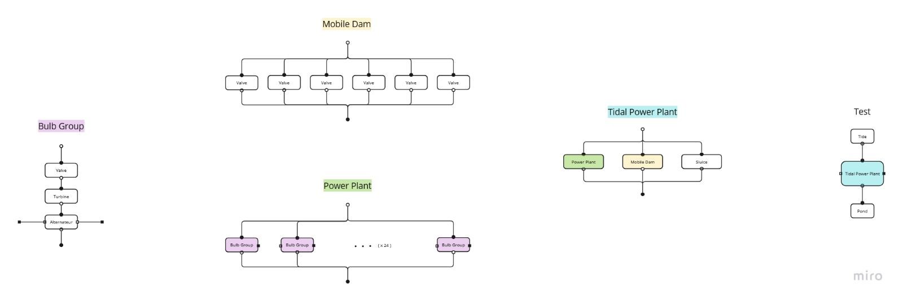

# Tidal Power Plant 1

---

## Table of Contents
1. [Introduction](#introduction)
2. [Prerequisites](#prerequisites)
3. [Project Structure](#project-structure)
4. [Components and Subcomponents](#components-and-subcomponents)
5. [Connectors Description](#connectors-description)
6. [Diagram of Model Structure](#diagram-of-model-structure)
7. [Contributions](#contributions)

---

## Introduction

This project demonstrates the operation of a tidal power plant, allowing us to model and analyze how effectively it harnesses energy from the tides.

## Prerequisites

- This project requires the software **OpenModelica** version **v1.24.2** or higher.
- To install OpenModelica, follow the [official guide](https://www.openmodelica.org/download).
- No additional dependencies are required.

---

## Project Structure

The project is organized into the `TidalPowerPlant` package, which includes:

### Main Components
The primary elements of the simulation:
- **Tidal Power Plant**
- **Tide**
- **Pond**

### Subpackage: `Components`
Contains the subcomponents of the tidal power plant:
- **Bulb Group**: Simulates a turbine-alternator unit.
- **Turbine**: Converts water flow into mechanical energy.
- **Valve**: Regulates the water flow.
- **Mobile Dam**: Controls water movement between subsystems.
- **Sluice**: Manages controlled water flow between reservoirs.
- **Alternator**: Converts mechanical energy into electrical energy.
- **Power Plant**: The primary energy generation unit.

### Subpackage: `Interfaces`
Defines connectors and partial classes:
- **Water Ports**: Acausal connectors for water flow and related parameters.

### Subpackage: `Tests`
Provides test models for complex components:
- Example: `TestPowerPlant`, which simulates the operation of the entire power plant.

---

## Components and Subcomponents

### Tidal Power Plant
The central system that integrates all components to simulate tidal energy generation. It is composed of:

- **Power Plant**: The main energy generation unit.
- **Mobile Dam**: Controls water flow between the sea and the basin.
- **Sluice**: Allows controlled water flow to maintain water levels and energy efficiency.

### Power Plant
The **Power Plant** consists of:
- **24 Bulb Groups**: Individual turbine-alternator units.
    - **Turbine**: Converts water flow into mechanical energy.
    - **Valve**: Controls the flow of water entering the turbine.
    - **Alternator**: Converts mechanical energy into electrical energy.

### Mobile Dam
- Composed of **6 Valves** for precise control of water flow between the basin and the tide.

### Sluice
- Manages controlled water flow between the sea and the basin to maintain optimal water levels and prevent overflow.

---

## Connectors Description
Most connectors in this model are acausal, with physical parameters defined for water volume flow rate and electrical power. The following table provides a summary of the connectors used in this model:

| Connector           | Parameter                  | Description                                   |
|---------------------|---------------------------|-----------------------------------------------|
| Tidal Power Plant $\leftrightarrow$ Pond/Tide | Water volume flow rate ($Q_v$) | Transfers the flow rate between subsystems. |
| Turbine $\leftrightarrow$ Alternator | Electrical power ($P_e$) | Links mechanical energy to electrical output.|

---

## Diagram of Model Structure

The following diagram illustrates the structure of the model components and their connections:

---

## Contributions
We welcome contributions to improve this project! 
- Submit a **pull request** with your proposed changes.  
- Raise an **issue** for bugs, suggestions, or feedback.  
- For large contributions, feel free to contact us to discuss your ideas beforehand.